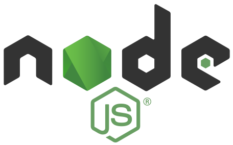

### Hi there, I'm David 👋

## I am a Backend Software Engineer who works in a SQL and Python based stack!

- 😄 Pronouns: he/his
- ⛏ I’m currently working at Compass Mining
- 🔐 I’m currently learning more about operating systems
- 🥅 2022 Goals: Continue to learn about backend engineering and AWS
- 🎧 Fun fact: I went to school to be an audio engineer for a little while

### Connect with me:

 

### Languages and Tools:

 
